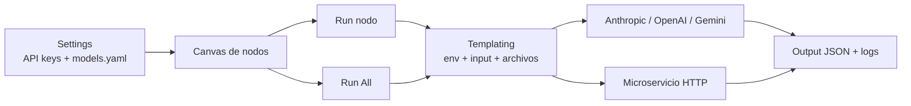

# Panel

Mini-n8n local para encadenar agentes LLM y microservicios HTTP mediante un canvas visual de nodos conectables.

## Vista rapida

## Requisitos previos

- Python 3.11+
- Node.js 20+
- `corepack` habilitado para usar `pnpm`
- `pip`

## Arranque local

1. Instala dependencias del backend:
	`cd backend && python -m pip install -e ".[dev]"`
2. Instala dependencias del frontend:
	`cd frontend && corepack pnpm install`
3. Arranca ambos servicios con [scripts/run.ps1](scripts/run.ps1) o [scripts/run.sh](scripts/run.sh).
4. Alternativa manual:
	`cd backend && python -m uvicorn app.main:app --host 127.0.0.1 --port 8000 --reload`
5. En otra terminal:
	`cd frontend && corepack pnpm dev --host 127.0.0.1 --port 5173`
6. Comprueba `GET http://127.0.0.1:8000/health` y abre `http://127.0.0.1:5173`.

## Uso rapido

1. Abre `Settings` y guarda las API keys necesarias en `backend/.env`.
2. Rellena [backend/config/models.yaml](backend/config/models.yaml) con ids oficiales de modelos.
3. Crea nodos Agente y Microservicio desde el canvas.
4. Guarda el flujo antes de subir adjuntos.
5. Ejecuta nodos individuales con `Run` o todo el flujo con `Run All`.
6. Revisa el panel lateral para ver configuración, output y logs de ejecución por nodo.

## Capacidades actuales

- Persistencia de flujos JSON en `backend/storage/flows/`.
- Upload y parseo de `.docx`, `.xlsx` y `.pdf` en `backend/storage/uploads/`.
- Templating backend para `{{env.KEY}}`, `{{input.campo}}` y `{{archivos.nombre}}`.
- Encadenamiento por predecesor con reutilización del último output persistido.
- Ejecución global con orden topológico.
- Soporte de modelos Anthropic, OpenAI y Gemini basado en catálogo.
- Viewer JSON colapsable con copia al portapapeles.
- Toasts UI y panel de logs por nodo con input, output, timestamps y errores.

## Storage local

- Flujos: `backend/storage/flows/`
- Adjuntos: `backend/storage/uploads/<flow_id>/<file_id>/`
- Runs: `backend/storage/runs/<run_id>.json`
- Settings: `backend/.env`

## Material visual sugerido

- Abre el canvas con un flujo de ejemplo cargado.
- Ejecuta `Run All` y captura el cambio de estados de `idle` a `running/success`.
- Abre un nodo y muestra el viewer de output junto al panel de logs.

## Troubleshooting

### El frontend no arranca

- Ejecuta el comando desde `frontend/`, no desde la raíz del repo.
- Usa `corepack pnpm dev --host 127.0.0.1 --port 5173`.

### El nodo Agente no muestra modelos

- Revisa [backend/config/models.yaml](backend/config/models.yaml).
- El catálogo puede estar vacío por diseño hasta que añadas ids oficiales.

### El nodo Agente falla por credenciales

- Guarda la clave del proveedor desde `Settings`.
- Verifica que `backend/.env` tenga la variable correcta: `ANTHROPIC_API_KEY`, `OPENAI_API_KEY` o `GEMINI_API_KEY`.

### `{{input.*}}` falla en un nodo encadenado

- Ejecuta antes el nodo predecesor o usa `Run All`.
- En esta versión cada nodo soporta un único predecesor entrante.

### No aparecen logs del nodo

- Guarda el flujo primero para que exista `flowId`.
- Ejecuta el nodo o el flujo completo y revisa `backend/storage/runs/`.

## Despliegue local recurrente

1. Mantén `backend/.env` fuera de git.
2. Versiona solo el catálogo en [backend/config/models.yaml](backend/config/models.yaml) sin claves secretas.
3. Usa `Run All` para validar regresiones funcionales rápidas del flujo.
4. Ejecuta `cd backend && pytest` y `cd frontend && corepack pnpm build` antes de cambios grandes.

## Referencias

- [PLAN.md](PLAN.md)
- [AGENTS.md](AGENTS.md)